# JavaScript Assigmnents

### Enter your age and find your Category
```
function human(age) {
    if (age >= 0 && age <= 10) {
        return "Your age is " + age + " you are a Baby";
    } else if (age >= 11 && age <= 20) {
        return "Your age is " + age + " you are a Teenager";
    } else if (age >= 21 && age <= 35) {
        return "Your age is " + age + " you are a Young";
    } else if (age >= 36 && age <= 120) {
        return "Your age is " + age + " you are a old";
    } else {
        return "I think he/she is no more";
    }
}
```
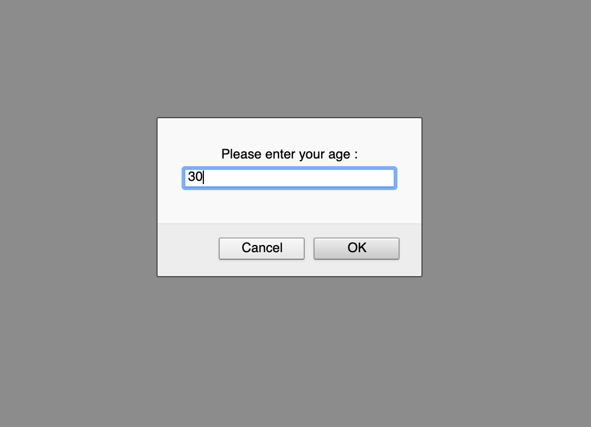
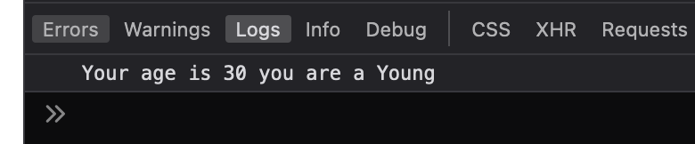

### For loop print 1 to 1000 but 700 to 900 will not be printed
```
for (let i = 1; i <= 1000; i++) {
    if (i >= 700 && i <= 900) {
        continue;
    }
    console.log("value = " + i);
}
```


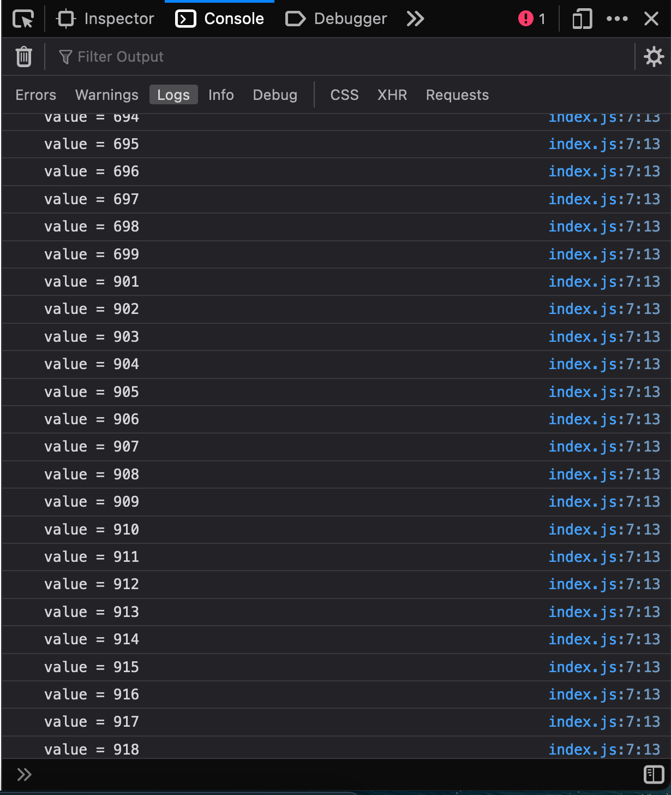

### For loop print 1 to 500 and we will find these number between 200 to 300 divided by 7
```
for (let i = 1; i <= 500; i++) {
    if (i >= 200 && i <= 300) {
        if (i % 7 === 0) {
            console.log(i);
        }
    }
}
```
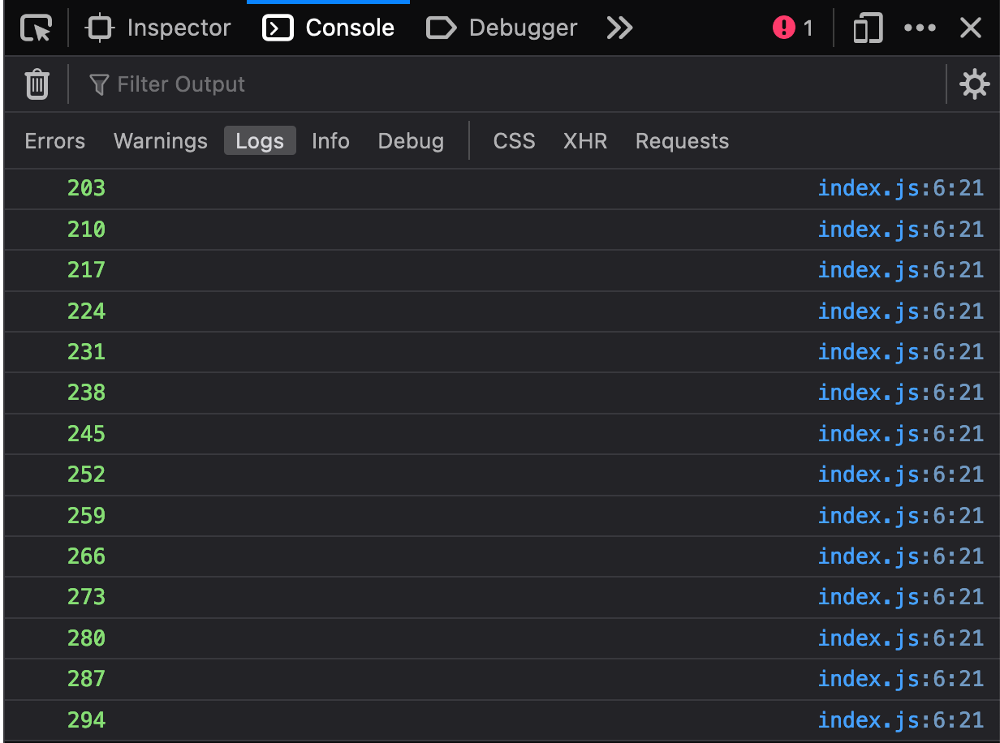

### Heading color change function
```
 <h1 id="heading">Choole color from dropdown</h1>
    <select name="" id="color" style="width: 100px">
      <option value="">- নির্বাচন করুন -</option>
      <option value="red">লাল</option>
      <option value="yellow">হলুদ</option>
      <option value="green">সবুজ</option>
      <option value="purple">পারপাল</option>
    </select>
    <button id="apply" onclick="myColor()" style="cursor: pointer">
      Apply
    </button>
    
    
    function myColor() {
    let choose = document.getElementById("color").value;
    document.getElementById("heading").style.color = choose;
}
```


### Body mass index calculation
```
let weight = prompt("Please enter your weight in kg : ");
let height = prompt("Please enter your height in meter : ");

function bms(weight, height) {
    let bmiHeight = height * height;
    let bmss = "Your BMI is : " + weight / bmiHeight;
    console.log(bmss);
}

bms(weight, height);
```
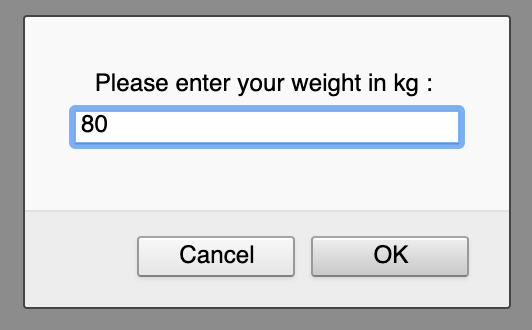
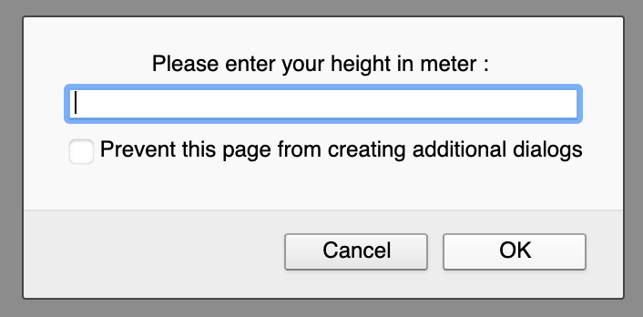
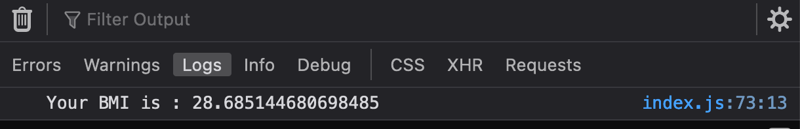

### age find out function
```
let birth = prompt("Please enter your Birth Year : ");
let date = new Date();
let year = date.getFullYear();

function myYear() {
    console.log("Your age is : " + (year - birth));
}
myYear();
```
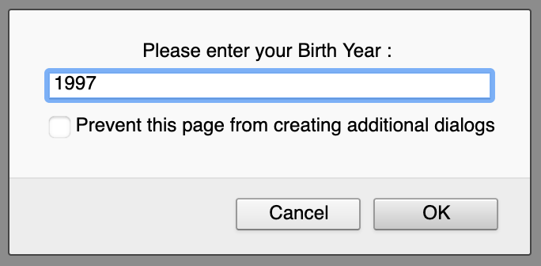
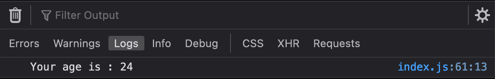

### Grade and GPA calculation
```
let number = prompt("Please enter your NUmber : ");

if (number >= 0 && number <= 33) {
    console.log("Sorry, Your are failed");
} else if (number >= 34 && number <= 50) {
    console.log("Passed! Your grade is C ");
} else if (number >= 51 && number <= 70) {
    console.log("Passed! Your grade is C ");
} else if (number >= 71 && number <= 80) {
    console.log("Passed! Your grade is B ");
} else if (number >= 81 && number <= 90) {
    console.log("Passed! Your grade is A ");
} else if (number >= 91 && number <= 100) {
    console.log("Passed! Your grade is A+ ");
} else {
    console.log("Invalid number given");
}
```
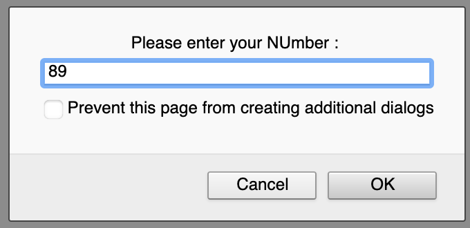
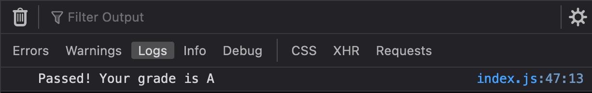

### Square and rectangle area calculation

```
function area(height, width) {
    function square(width) {
        console.log(
            "height or width is " + width + " Squre area is : " + width * width
        );
    }
    square(21);

    function rectangle(height, width) {
        console.log( "height = " + height + " and  width = " + width + " rectangle area is : " + height * width );
    }

    rectangle(14, 40);
}
area();
```
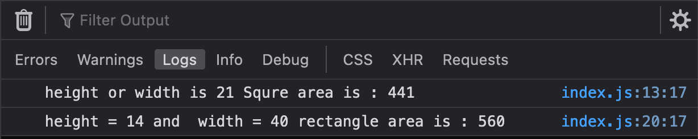
